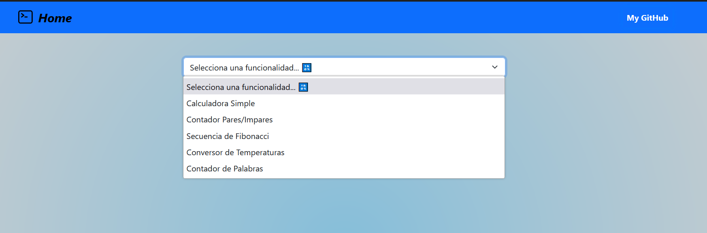
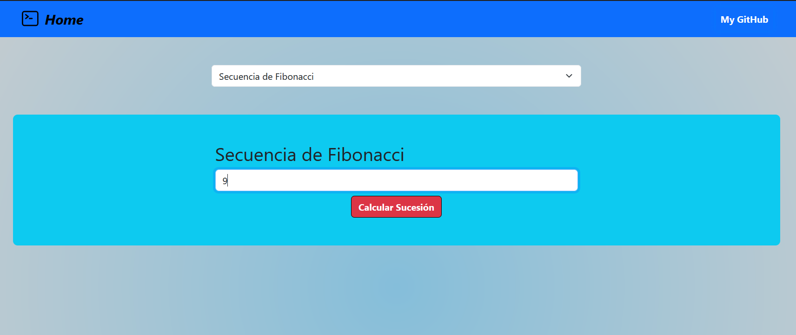
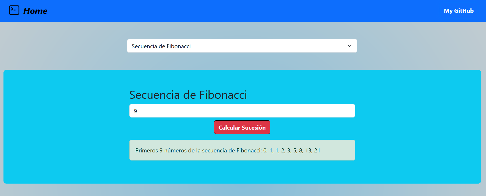
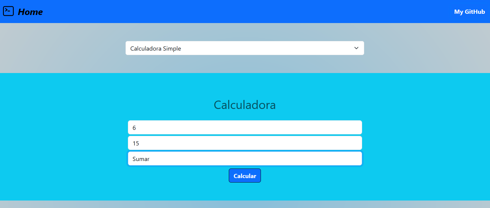
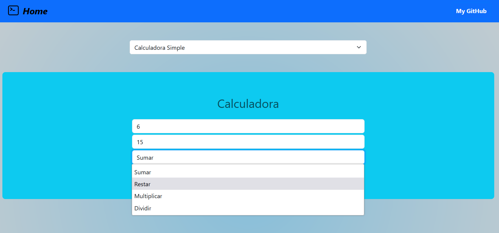
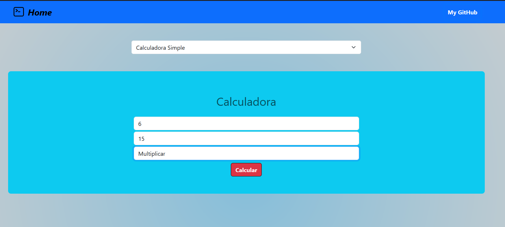
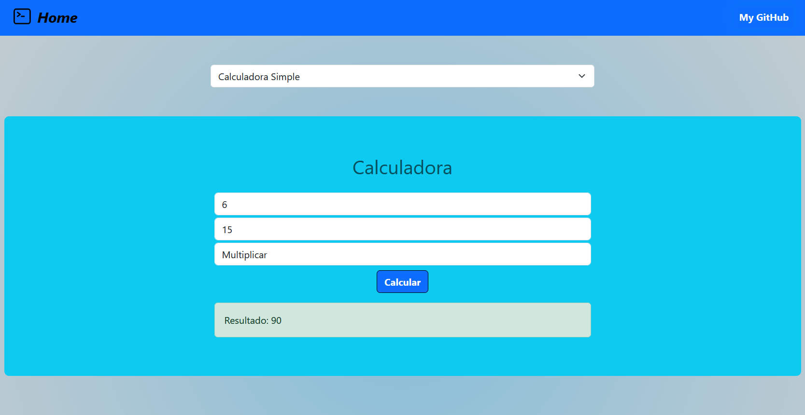

# TypeScript App
This repo was created to address some practical questions about TypeScript posed by the 'Programming Languages Workshop IV' class.
It is a simple web app made with the framework **Vite** using **React** and **TypeScript**.

*Este repositorio fue creado para abordar algunas preguntas prácticas sobre TypeScript planteadas por la clase 'Taller de Lenguajes de Programación IV'*.
*Es una simple aplicación de tareas hecha con el framework **Vite** utilizando **React** y **TypeScript***.

## Tecnologías utilizadas:
<div align="center" style="display: flex">
      <span>
         <a href="https://es.javascript.info/" target="_blank">
               
         </a>
      </span>
      <span>
         <a href="https://www.w3schools.com/html/default.asp" title='html' target="_blank">
               
         </a>
      </span>
      <span>
         <a href="https://www.w3schools.com/css/default.asp" title='CSS' target="_blank">
               
         </a>
      </span>
      <br/>
      <span>
         <a href="https://www.typescriptlang.org/" target="_blank" title='TypeScript'>
               
         </a>
      </span>
      <span>
         <a href="https://react.dev/" target="_blank" title='React'>
               
         </a>
      </span>
      <span>
         <a href="https://getbootstrap.com/docs/5.3/getting-started/download/" title='Bootstrap 5' target="_blank">
               
         </a>
      </span>

</div>

#### Para ejecutar o utilizar el proyecto debes clonar este repositorio en un directorio de tu sistema. Abre una terminal y ejecuta el siguiente comando:

```bash
git clone https://github.com/tasksAndWorks/tlp4-tpTypeScriptReact.git
```

#### Con una terminal localizarse en el directorio del proyecto y ejecutar:
```bash
yarn install
```
o
```bash
npm install
```

#### Para ejecutar el proyecto:
```bash
yarn dev
```
o
```bash
npm run dev
```









